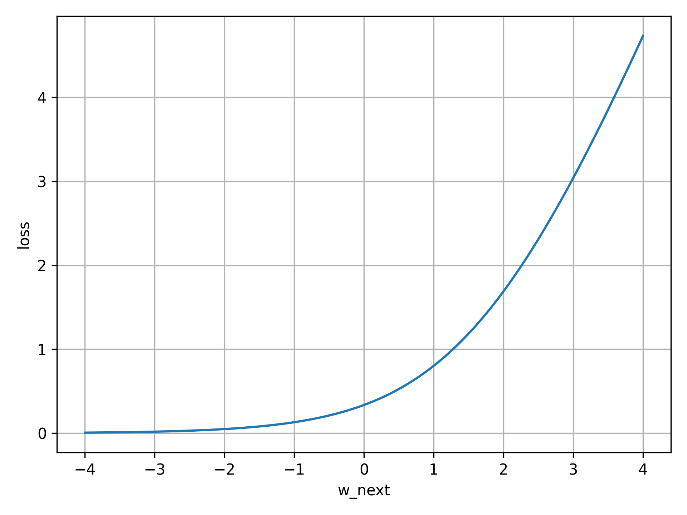
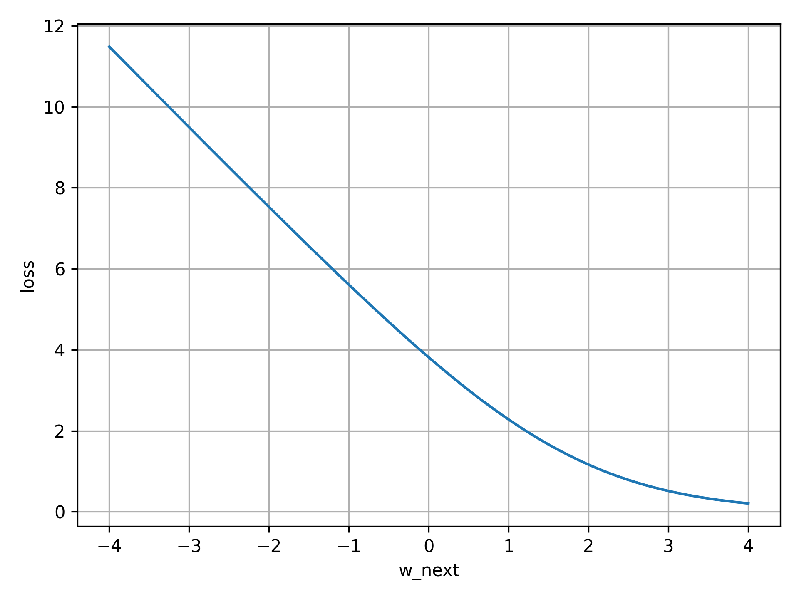
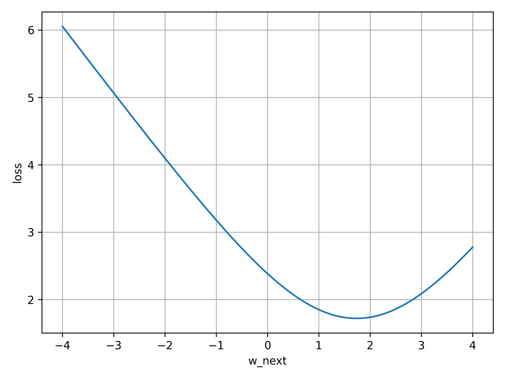

# Binary Cross Entropy

## Computation of the optimal weight

### Algorithm

In order to find the optimal weight `w_next` XGBoost minimizes the following loss function:
```Python
loss_sum(labels, w_last, w_next)
```

Where the loss is defined as follows:
```Python
def loss_sum(labels, w_last_list, w_next):
    loss_sum = 0.0
    for label, w_last in zip(labels, w_last_list):
        loss_sum += loss(label, w_last + w_next)
    return loss_sum
```

```Python
def loss(label, logit):
    prob = sigmoid(logit)
    return -(label * log(prob) + (1.0 - label) * log(1.0 - prob))
```

In general the second order Taylor series looks as follows (where `g` is the first derivative and `h` the second derivative)
```Python
f(x) ≈ f(a) + g(a) * (x-a) + 0.5 * h(a) * pow((x-a), 2)
```

Rewriting the binary cross entropy loss function as a taylor series yields

```Python
loss_last = loss_sum(labels, w_last, 0)
g = sum_gradients(labels, w_last)
h = sum_hessians(w_last)
x = w_last + w_next
a = w_last

loss = loss_last + g * w_next + 0.5 * h * pow(w_next, 2)
```

The derivative of the taylor loss is
```Python
g * h * w_next
```

And the root of the derivative is
```Python
g * h * w_next = 0
w_next = -g/h
```

### Examples

For the exact loss function a distinction could be made between 3 cases:
* All labels are 0
* All labels are 1
* Mixture of 0 and 1 labels

#### All labels are 0
```Python
w_last = [-1.42785195 -2.04789617]
labels = [0, 0]
```

In case all labels are 0 there is no minima.



#### All labels are 1

```Python
w_last = [-1.42785195 -2.04789617]
labels = [1, 1]
```
In case all labels are 0 there is no minima.



#### Mixture of 0 and 1 labels
In case there is a mixture of 0 and 1 labels the loss function has a minima. The minima can't be 
determined analytically.

```Python
w_last = [-1.42785195 -2.04789617]
labels = [0, 1]
```


## Newton method
In order to find the minima of a loss function XGBoost uses the [Newton method](https://en.wikipedia.org/wiki/Newton%27s_method_in_optimization).

The Newton method uses a sequence of second-order approximations of the loss function around the iterates (`w_last`).

``` Python
for i in range(num_iterations):
    t = -sum_gradients(labels, w_last) / sum_hessians(w_last)
    l = taylor_loss(labels, w_last, t)
    w_optimal += t
    w_last = w_last + t
```
Each iteration of the XGBoost only performs one iteration in order to compute `w_optimal`. 

### Example
```Python
w_last = [-1.42785195 -2.04789617 -1.33124088 -0.24409868 -1.07399676]
labels = [0, 1, 1, 1, 1]
```

After the first iteration the minima of the exact loss function deviates from
the minima of the taylor series.


With every iteration the minima of the taylor series moves closer to the minima
of the exact loss function:

