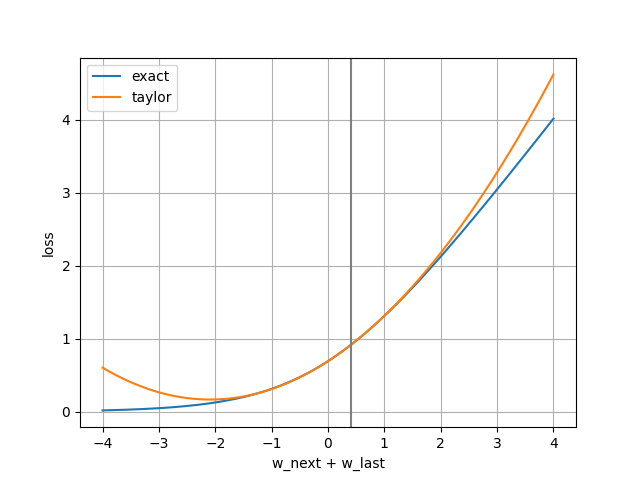
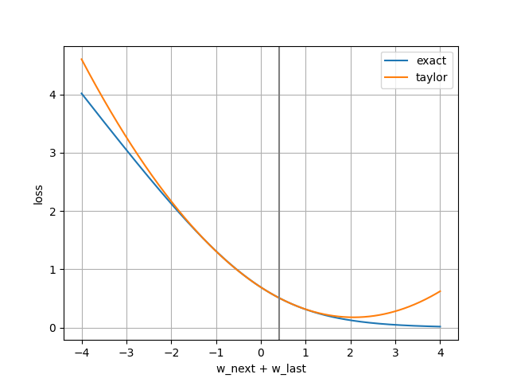
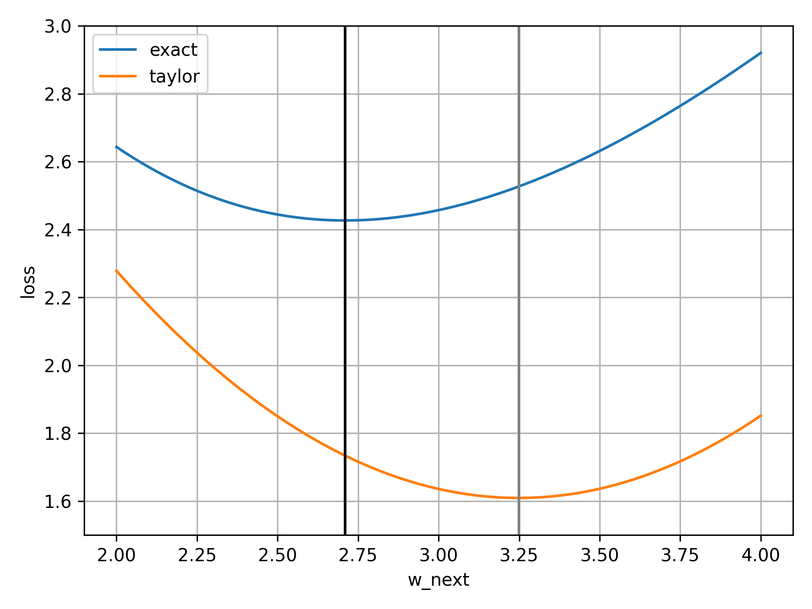

# Binary Cross Entropy

## Computation of the optimal weight

### Algorithm

In order to find the optimal weight `w_next` XGBoost minimizes the following loss function:
```
loss_sum(labels, w_last + w_next)
```

Where the loss is defined as follows:
```
def loss_sum(labels, logit):
    prob = sigmoid(logit)
    loss_sum = 0.0
    for label in labels:
        loss_sum += loss(label, prob)
    return loss_sum
```

I general the second order Taylor series looks as follows (where `g` is the first derivative and `h` the second derivative)
```
f(x) ≈ f(a) + g(a) * (x-a) + 0.5 * h(a) * pow((x-a), 2)
```

Rewriting the binary cross entropy loss function as a taylor series yields

```
loss_last = loss_sum(labels, w_last)
g = sum_gradients(labels, w_last)
h = sum_hessians(labels, w_last)
x = w_last + w_next
a = w_last

loss = loss_last + g * w_next + 0.5 * h * pow(w_next, 2)
```

The derivative of the taylor loss is
```
g * h * w_next
```

For the root of the derivative follows
```
g * h * w_next = 0
w_next = -g/h
```

### Examples
A distinction could be made between 3 cases:
* All labels are 0
* All labels are 1
* Mixture of 0 and 1 labels

#### All labels are 0
```
w_last = 0.4
labels = [0]
```

In case all labels are 0 there is no minima.



#### All labels are 1

```
w_last = 0.4
labels = [1]
```
In case all labels are 0 there is no minima.



#### Mixture of 0 and 1 labels
In case there is a mixture of 0 and 1 labels there a minima exists.

```
w_last = 0.4
labels = [0, 1]
```


## Newton method
```
w_last = 0.4
labels = [0, 1, 1, 1, 1, 1, 1, 1, 1, 1]
```

In order to find the minima of a loss function XGBoost uses the [Newton method](https://en.wikipedia.org/wiki/Newton%27s_method_in_optimization).

The Newton method uses a sequence of second-order approximations of the loss function around the iterates (`w_last`).

### Example
After the first iteration the minima of the exact loss function deviates from
the minima of the taylor series.


With every iteration the minima of the taylor series moves closer to the minima
of the exact loss function:
